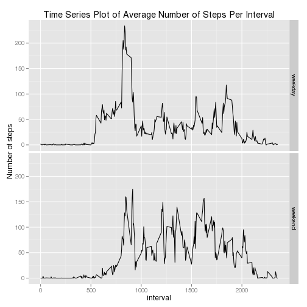

## Reproducible Research: Peer Assessment 1
========================================================
# Loading and preprocessing the data


```r
unz("activity.zip", filename = "activity.csv")->activity

read.csv(activity, header=T)->d
```
## What is mean total number of steps taken per day?
Calculate and report the mean and median total number of steps taken per day

```r
tapply(d$steps,d$date,sum)->dd
print("mean is:");mean(dd,na.rm=T)
```

```
## [1] "mean is:"
```

```
## [1] 10766
```

```r
print("median is:");median(dd,na.rm=T)
```

```
## [1] "median is:"
```

```
## [1] 10765
```

Make a histogram of the total number of steps taken each day

```r
hist(dd, xlab = "total number of steps taken per day",breaks=30,main="total number of steps taken each day",bg = "transparent")
```

 

## What is the average daily activity pattern?

Make a time series plot (i.e. type = "l") of the 5-minute interval (x-axis) and the average number of steps taken, averaged across all days (y-axis)


```r
tapply(d$steps,d$interval,mean,na.rm=T)->b
subset(d,date=="2012-10-01",select=interval)->int
data.frame(intervals = int, mean=b)->data
plot(b,type = "l",xlab="Interval",ylab="Average number of steps",main="Average steps per 5-minute interval")
```

 


Which 5-minute interval, on average across all the days in the dataset, contains the maximum number of steps?


```r
which.max(data$mean)->max
data[max,]
```

```
##     interval  mean
## 104      835 206.2
```


## Imputing missing values

Note that there are a number of days/intervals where there are missing values (coded as NA). The presence of missing days may introduce bias into some calculations or summaries of the data.

Calculate and report the total number of missing values in the dataset (i.e. the total number of rows with NAs)

```r
nrow(d[is.na(d$steps),])
```

```
## [1] 2304
```

Devise a strategy for filling in all of the missing values in the dataset. The strategy does not need to be sophisticated. For example, you could use the mean/median for that day, or the mean for that 5-minute interval, etc.

Create a new dataset that is equal to the original dataset but with the missing data filled in.

Make a histogram of the total number of steps taken each day and Calculate and report the mean and median total number of steps taken per day. Do these values differ from the estimates from the first part of the assignment? What is the impact of imputing missing data on the estimates of the total daily number of steps?


```r
merge(d, data, by = 'interval', all.y = F)->new.data
new.data$steps[is.na(new.data$steps)] <- new.data$mean[is.na(new.data$steps)]
tapply(new.data$steps,new.data$date,sum)->bb
hist(bb, xlab = "total number of steps taken per day",breaks=30,main="Number of steps per day (estimated missing data)")
```

 

```r
print("mean is:");mean(bb,na.rm=T)
```

```
## [1] "mean is:"
```

```
## [1] 10766
```

```r
print("median is:");median(bb,na.rm=T)
```

```
## [1] "median is:"
```

```
## [1] 10766
```
They are roughly the same,  there is no impact of replacing missing data on the estimates of the total daily number of steps

## Are there differences in activity patterns between weekdays and weekends?
For this part the weekdays() function may be of some help here. Use the dataset with the filled-in missing values for this part.


```r
weekdays(as.Date(d$date))->w
"weekday"->d[,"daytype"]
d$daytype[w == "Saturday"] <- "weekend"
d$daytype[w == "Sunday"] <- "weekend"
```

Make a panel plot containing a time series plot (i.e. type = "l") of the 5-minute interval (x-axis) and the average number of steps taken, averaged across all weekday days or weekend days (y-axis). The plot should look something like the following, which was creating using simulated data:

```r
aggregate(steps ~ interval + daytype, d, mean)->new
names(new)[3] <- "mean"

library(ggplot2)
ggplot(new) + aes(x = interval, y = mean) + facet_grid(daytype ~ 
    .) + geom_line() + labs(title = "Time Series Plot of Average Number of Steps Per Interval", 
    y = "Number of steps")
```

 
